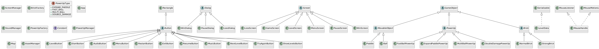
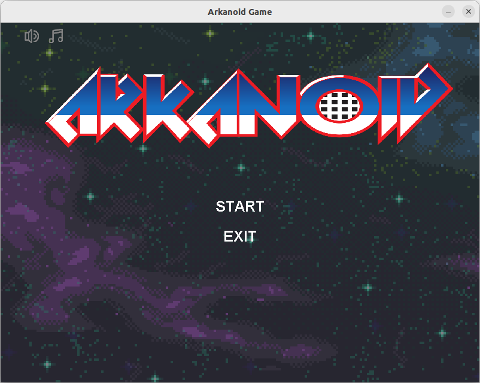
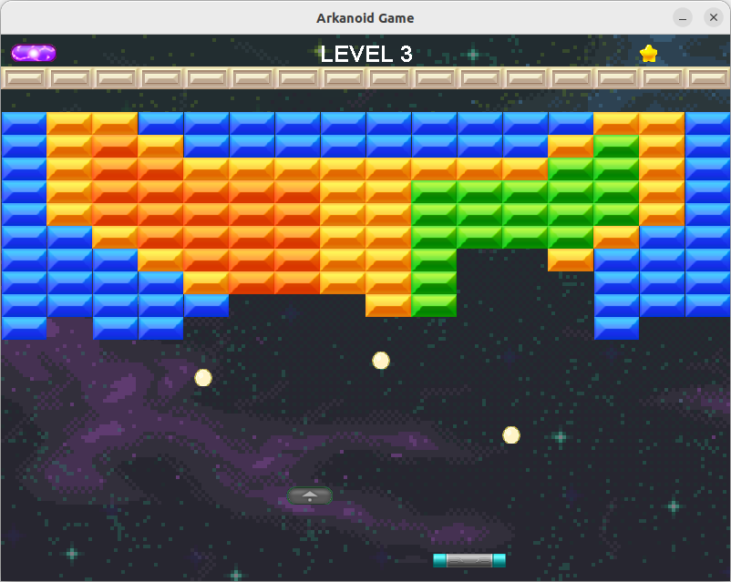
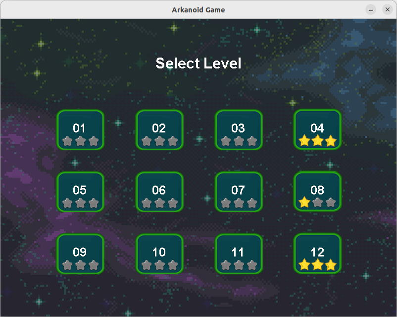
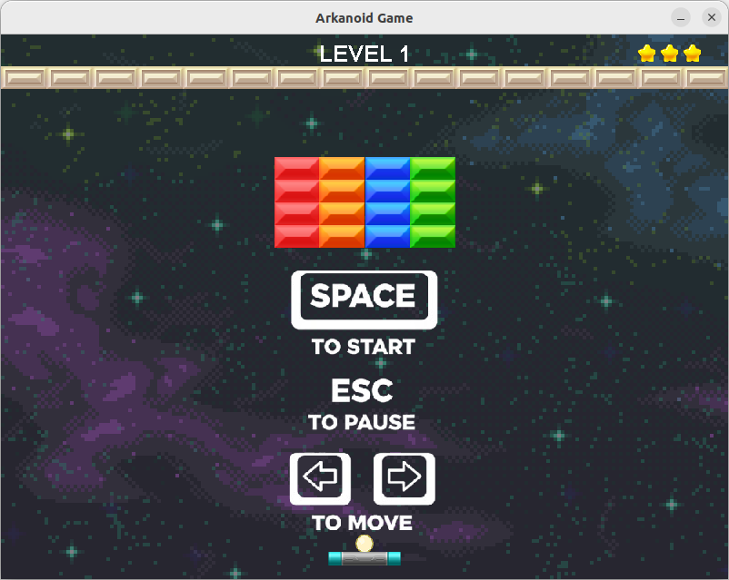

# Arkanoid Game - Object-Oriented Programming Project

## Author
Group 3 - Class INT2204 5
1. Đào Văn Huân - 24020143
2. Lê Bá Minh Hiếu - 24020125
3. Phan Văn Phước Hưng - 24020152
4. Nguyễn Duy Anh - 24020014

**Instructor**: Nguyễn Thu Trang, Trương Xuân Hiếu, Kiều Văn Tuyên  
**Semester**: HK1 - 2526

---

## Description
**Arkanoid** is a classic brick-breaking arcade game developed in Java as the final project for the Object-Oriented Programming course.
The game showcases the application of key OOP principles — including **encapsulation, inheritance, polymorphism, and abstraction** — along with several **design patterns** to ensure scalability and maintainability.

**Key features:**
1. The game is developed using Java 21+ with Swing for GUI.
2. Implements core OOP principles: Encapsulation, Inheritance, Polymorphism, and Abstraction.
3. Applies multiple design patterns: Singleton, Factory Method.
4. Multiple levels with increasing difficulty.
5. Features multithreading for smooth gameplay and responsive UI.
6. Includes sound effects, animations, and power-up systems.
7. Supports save/load game functionality and level system.

**Game mechanics:**
- Control a paddle to bounce a ball and destroy bricks
- Collect power-ups for special abilities
- Progress through multiple levels with increasing difficulty
---

## UML Diagram

### Class Diagram

---

## Design Patterns Implementation

### 1. Singleton Pattern
**Used in:** `SoungManager`, `AssetManager`

**Purpose:** Ensure only one instance exists throughout the application.
### 2. Factory Method
**Used in:** `PowerUp`, `Brick`

**Purpose:** Provide a flexible way to create different types of objects (such as various bricks or power-ups) without specifying their exact classes.

---

## Multithreading Implementation
The game uses multiple threads to ensure smooth performance:

1. **Game Loop Thread** – Updates game logic and physics at a consistent 60 FPS.
2. **Rendering Thread (Event Dispatch Thread – EDT)** – Handles all Swing UI rendering and component updates safely.
3. **Audio Thread Pool** – Plays background music and sound effects asynchronously to prevent lag during gameplay.
4. **I/O Thread** – Manages saving and loading player data (e.g., stars, progress) without blocking the main game loop or UI thread.

---

## Installation

1. Clone the project from the repository.
2. Open the project in the IDE.
3. Run the project.

## Usage

### Controls
| Key | Action |
|-----|--------|
| `←` | Move paddle left |
| `→` | Move paddle right |
| `SPACE` | Launch ball |
| `ESC` | Pause game |

### How to Play
1. **Start the game**: Click **START** from the main menu.
2. **Control the paddle**: Use arrow keys to move left and right.
3. **Launch the ball**: Press SPACE to launch the ball from the paddle.
4. **Destroy bricks**: Bounce the ball to hit and destroy bricks.
5. **Collect power-ups**: Catch falling power-ups for special abilities.
6. **Avoid losing the ball**: Keep the ball from falling below the paddle.
7. **Complete the level**: Destroy all destructible bricks to advance.

### Power-ups
| Icon | Name | Effect |
|------|------|--------|
| 🟦 | Expand Paddle | Increases paddle width for 8 seconds |
| ⚡ | Fast Ball | Increases ball speed by 40% |
| 🎯 | Multi Ball | Spawns 2 additional balls |

### Level System
- **12 unique levels**, each designed with different brick layouts, colors, and difficulty.
- When a player completes a level, their performance is rated with stars (from 1 to 3) based on remaining lives.
- These stars are saved automatically, allowing players to track their achievements
---

## Demo

### Screenshots

**Main Menu**  

**Gameplay**  

**Power-ups**  

**Level System**  

### Video Demo

*Full gameplay video is available in `docs/demo/demo.webm`*

---

## Future Improvements

### Planned Features
1. **Additional game modes**
   - Survival mode with endless levels
   - Co-op multiplayer mode
    - Scoring system
2. **Enhanced gameplay**
   - Boss battles at end of worlds
   - More power-up varieties (freeze time, shield wall, fire ball, etc.)
   

3. **Technical improvements**
   - Migrate to JavaFX for better graphics
   - Add particle effects and advanced animations
   - Implement AI opponent mode
   - Add online leaderboard with database backend

---

## Technologies Used

| Technology | Version | Purpose |
|------------|---------|---------|
| Java | 21+ | Core language |
| Java Swing | ? | GUI framework |
| Maven | 3.9+ | Build tool |

---

## License

This project is developed for educational purposes only.

**Academic Integrity:** This code is provided as a reference. Please follow your institution's academic integrity policies.

---

## Notes

- The game was developed as part of the Object-Oriented Programming with Java course curriculum.
- All code is written by group members with guidance from the instructor.
- Some assets (images, sounds) may be used for educational purposes under fair use.
- The project demonstrates practical application of OOP concepts and design patterns.

---

*Last updated: 11/11/2025*
